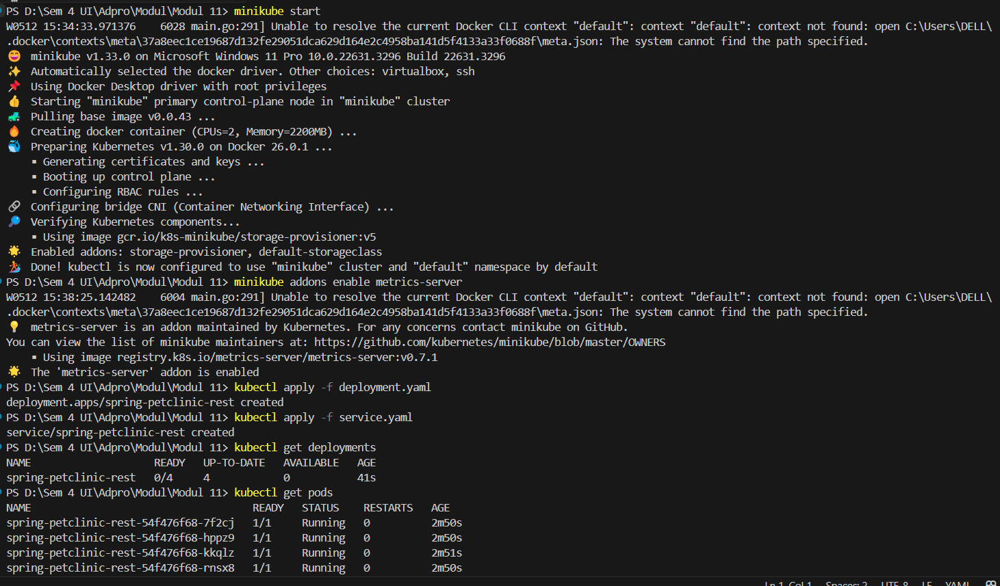
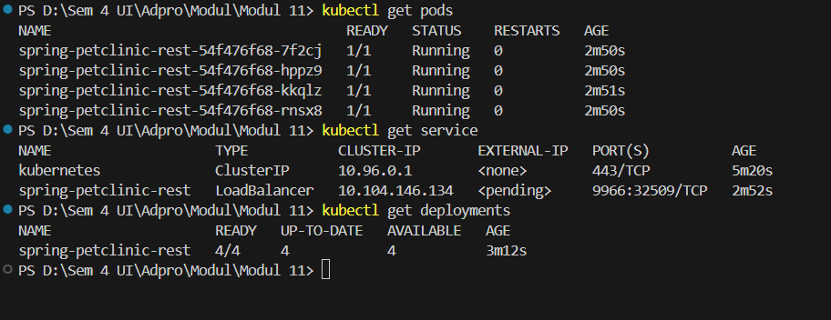

Modul 11 

Reflection on minicube

Answer the following questions to guide your reflection:

1. Compare the application logs before and after you exposed it as a Service.

Before exposing your application as a service in Kubernetes, the application is running in a pod, but it's not accessible from outside the Kubernetes cluster. The logs of the application at this stage would typically show the internal workings of the application, such as startup logs, internal processes, and any interactions it might have with other services within the cluster.

When you expose your application as a service, you're making it accessible from outside the Kubernetes cluster. This could be from other services within the cluster, from other pods, or from the internet, depending on how you've configured the service.

After exposing the application as a service, if the application logs incoming requests, We should start seeing these in the logs. Each time a request is made to the application, a new log entry should be created. This means that the more I access the application, the more log entries you'll see.

In summary, before exposing the application as a service, the logs primarily show internal application processes. After exposing it as a service, the logs also start showing incoming network requests.

2. Notice that there are two versions of `kubectl get` invocation during this tutorial section.
13
The first does not have any option, while the latter has `-n` option with value set to
`kube-system`.
What is the purpose of the `-n` option and why did the output not list the pods/services that you
explicitly created?

The -n option in kubectl get is utilized to specify the namespace where the command should look for resources. Namespaces in Kubernetes serve as a method for partitioning resources of the cluster among multiple users or teams.

When kubectl get pods is executed without the -n option, it returns pods from the default namespace. This is the reason it doesn't display pods or services from the kube-system namespace.

On the other hand, when kubectl get pods -n kube-system is executed, it returns pods from the kube-system namespace. The kube-system namespace is a reserved namespace for system pods necessary for the operation of Kubernetes.

The output did not list the pods/services that were explicitly created because they were likely created in the default namespace, not in the kube-system namespace. The kube-system namespace is typically used for system-level pods, not for applications created by users.

Reflection on Rolling Update & Kubernetes Manifest File

1. What is the difference between Rolling Update and Recreate deployment strategy?

Rolling Update: This strategy incrementally updates Pods instances with new ones. The new Pods will be scheduled on Nodes with available resources. During a rolling update, multiple versions of the application will coexist in the system for a period of time. This strategy ensures zero downtime during the deployment process.

Recreate: This strategy involves taking down the existing version completely before the new version is brought up. This could lead to application downtime. It is a simpler approach but less flexible compared to the rolling update strategy.

Rolling Update:
- Benefits: 
  - Zero downtime during the deployment process.
  - The application remains available to users, and new features can be gradually rolled out.
- Drawbacks: 
  - If the new version of the application is incompatible with the old version, there might be issues as both versions will coexist for a period of time.
  - It might take longer to roll out a new version as it's done incrementally.
- Other considerations: 
  - It's important to have proper health checks in place to ensure that new pods are working correctly before old pods are terminated.

Recreate:
- Benefits: 
  - It's a simpler approach and can be useful if you need to completely replace the application version and don't need to worry about compatibility between versions.
  - It can be faster to roll out a new version as it's not done incrementally.
- Drawbacks: 
  - The application will have downtime during the deployment process as the old version is taken down before the new version is brought up.
  - Users might experience disruption as the application will be unavailable for a period of time.
- Other considerations: 
  - It's important to schedule the deployment during a maintenance window or a period of low usage to minimize the impact of the downtime.

  2.  Try deploying the Spring Petclinic REST using Recreate deployment strategy and document
your attempt.

This is my step to deploy it:

first, start the minikube with 

<pre>minikube start</pre>

then Enable Metric servers

<pre>minikube addons enable metrics-server</pre>

then Create deployment.yaml and service.yaml

then Apply the deployment 

<pre>kubectl apply -f deployment.yaml
kubectl apply -f service.yaml </pre>

then verify the developent like this 

<pre>kubectl get deployments
kubectl get pods
kubectl get service </pre>

then we can access the application with this comment

<pre>minikube service spring-petclinic-rest</pre>

Now we can access the Spring Petclinic REST application using the Minikube service

3. Prepare different manifest files for executing Recreate deployment strategy

make 2 file 

first is deployment.yaml like this 

<pre>apiVersion: apps/v1
kind: Deployment
metadata:
    name: spring-petclinic-rest
spec:
    replicas: 3
    selector:
    matchLabels:
        app: spring-petclinic-rest
    template:
    metadata:
        labels:
        app: spring-petclinic-rest
    spec:
        containers:
        - name: spring-petclinic-rest
        image: docker.io/springcommunity/spring-petclinic-rest:3.2.1
        ports:
        - containerPort: 9966
    strategy:
    type: Recreate</pre>

    then make service.yaml like this 

<pre>
apiVersion: v1
kind: Service
metadata:
    name: spring-petclinic-rest
spec:
    type: LoadBalancer
    selector:
    app: spring-petclinic-rest
    ports:
    - protocol: TCP
    port: 9966
    targetPort: 9966
</pre>

then apply the file with this syntax kubectl apply -f <filename.yaml> command. Adjust the image version or other parameters as needed for specific setup.

4. What do you think are the benefits of using Kubernetes manifest files? Recall your experience in deploying the app manually and compare it to your experience when deploying the same app by applying the manifest files (i.e., invoking kubectl apply -f command) to the cluster.

Using Kubernetes manifest files has several benefits:

Reproducibility: By defining your application's configuration in a manifest file, you can version control it and reproduce the same deployment across different environments.

Automation: Applying manifest files allows you to automate the deployment process, reducing the risk of human error and making the process more efficient.

Consistency: Manifest files ensure that your application's configuration is consistent across all deployments, which can help prevent issues caused by configuration drift.

Documentation: Manifest files serve as a form of documentation, providing a clear and concise way to understand how an application is configured and deployed.

Comparing this to manual deployment, manual deployment can be error-prone, time-consuming, and difficult to reproduce consistently. It also doesn't provide the same level of documentation or automation as using manifest files. Therefore, using Kubernetes manifest files is generally a more reliable and efficient approach to deploying applications.

